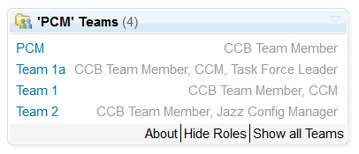

[![travis-svg][travis-svg]][travis]

# My Teams Widget for RTC

This widget expands the standard RTC Teams widget with an option to only show the teams the authenticated user is part of. It can also show the users roles. The widget is intended to allow users a quick navigation and better overview, especially
when there are a lot of teams.

## States
The widget offers three different states, easily changeable by clicking the corresponding buttons:
1. Show only the Teams the user is part of and the roles he has
2. Show only the Teams the user is part of without the Roles
3. Show all Teams

- When showing only the Teams the user is part of, the Project is displayed as well and all teams are included even if it's on a dashboard of a Subteam.
- The users roles also include inherited roles.

## Setup

### Download
You can find the latest release on the [releases page of this repository](../../releases).

### Installation
Deploy just like any other update site:

1. Extract the `com.siemens.bt.jazz.viewlet.myteams.Team_updatesite.ini` **file** from the zip file to the `server/conf/ccm/provision_profiles` directory
2. Extract the `com.siemens.bt.jazz.viewlet.myteams.Team_updatesite` **folder** to the `server/conf/ccm/sites` directory
3. Restart the server

### Updating an existing installation
1. Request a server reset in **one** of the following ways:
    * If the server is currently running, call `https://server-address/ccm/admin/cmd/requestReset`
    * Navigate to `https://server-address/ccm/admin?internaltools=true` so you can see the internal tools (on the left in the side-pane).
     Click on `Server Reset` and press the `Request Server Reset` button
    * If your server is down, you can delete the ccm `built-on.txt` file.
     Liberty packed with 6.0.3 puts this file in a subfolder of `server/liberty/servers/clm/workarea/org.eclipse.osgi/**/ccm`. The easiest way to locate the file is by using your operating system's search capabilities.
2. Delete previously deployed updatesite folder
3. Follow the file extraction steps from the section above
4. Restart the server

### Configuration

1. Add the Widget to a Dashboard. The widget can be found in the **"Project/Team"** category.
2. In the settings section of the added widget, make sure that a project or team area is assigned.
3. Under Settings, the default State (my/all Teams, w/o Roles) can be optionally configured.

")

# About this Plug-In
## Contributing
Please use the [Issue Tracker](../../issues) of this repository to report issues or suggest enhancements.

For general contribution guidelines, please refer to [CONTRIBUTING.md](https://github.com/jazz-community/welcome/blob/master/CONTRIBUTING.md)

## Licensing
Copyright (c) Siemens AG. All rights reserved. 
Licensed under the [MIT](./LICENSE) License.

[travis-svg]: https://travis-ci.org/jazz-community/rtc-myTeams-widget.svg?branch=master
[travis]: https://travis-ci.org/jazz-community/rtc-myTeams-widget
